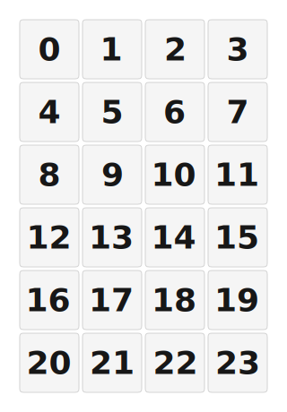

# ZMK Configuration for numpad123-4x6

*Generated by Shield Wizard for ZMK*



Download compiled firmware from the Actions tab. <https://zmk.dev/docs/user-setup#installing-the-firmware>

Edit your keymap <https://zmk.dev/docs/keymaps>.
User keymap is located at [`config/numpad123_4x6.keymap`](config/numpad123_4x6.keymap).

-----

<details>
<summary>
Shield Wizard Debug Information
</summary>

In case of broken configuration, here is the Shield Wizard internal data used to generate this configuration:

Commit: 0364074123b384abd5563bc6cdf4473384edaabb

```json
{"name":"numpad123-4x6","shield":"numpad123_4x6","dongle":true,"modules":[],"layout":[{"id":"01KWFJW2RJRSEZ635H21YZSBSC","part":0,"row":0,"col":3,"w":1,"h":1,"x":3,"y":0,"r":0,"rx":0,"ry":0},{"id":"01KWFG0JH8A505NZXSWQYZ80E3","w":1,"h":1,"x":0,"y":1,"r":0,"rx":0,"ry":0,"part":0,"row":1,"col":0},{"id":"01KWFG0JH8ECT2CNHGQTHE3KFF","w":1,"h":1,"x":1,"y":1,"r":0,"rx":0,"ry":0,"part":0,"row":1,"col":1},{"id":"01KWFG0JH803DSH9WPG6V6ETT1","w":1,"h":1,"x":2,"y":1,"r":0,"rx":0,"ry":0,"part":0,"row":1,"col":2},{"id":"01KWFG0JH86EKQJZ0H4J574R9F","w":1,"h":1,"x":3,"y":1,"r":0,"rx":0,"ry":0,"part":0,"row":1,"col":3},{"id":"01KWFG0JH8R5GDF0M54TN7JTTG","w":1,"h":1,"x":0,"y":2,"r":0,"rx":0,"ry":0,"part":0,"row":2,"col":0},{"id":"01KWFG0JH8YYY4FV07ENKSP100","w":1,"h":1,"x":1,"y":2,"r":0,"rx":0,"ry":0,"part":0,"row":2,"col":1},{"id":"01KWFG0JH8DN06Y9AR2HY6P5FS","w":1,"h":1,"x":2,"y":2,"r":0,"rx":0,"ry":0,"part":0,"row":2,"col":2},{"id":"01KWFG0JH87JMZVJ4H8TYZH2C8","w":1,"h":1,"x":3,"y":2,"r":0,"rx":0,"ry":0,"part":0,"row":2,"col":3},{"id":"01KWFG0JH8YJHY7CKNAKNJ9YP0","w":1,"h":1,"x":0,"y":3,"r":0,"rx":0,"ry":0,"part":0,"row":3,"col":0},{"id":"01KWFG0JH8NXSYHD7RJDTTAM0V","w":1,"h":1,"x":1,"y":3,"r":0,"rx":0,"ry":0,"part":0,"row":3,"col":1},{"id":"01KWFG0JH9PQYZ5T7D67WZQZES","w":1,"h":1,"x":2,"y":3,"r":0,"rx":0,"ry":0,"part":0,"row":3,"col":2},{"id":"01KWFG0JH94F9HD5TVDNV711TY","w":1,"h":1,"x":3,"y":3,"r":0,"rx":0,"ry":0,"part":0,"row":3,"col":3},{"id":"01KWFG0JH9HSEJW0BA4MVRJDTN","w":1,"h":1,"x":0,"y":4,"r":0,"rx":0,"ry":0,"part":0,"row":4,"col":0},{"id":"01KWFG0JH94VK9D3A1D921AZ58","w":1,"h":1,"x":1,"y":4,"r":0,"rx":0,"ry":0,"part":0,"row":4,"col":1},{"id":"01KWFG0JH9259M5K7MHTZ6DGDD","w":1,"h":1,"x":2,"y":4,"r":0,"rx":0,"ry":0,"part":0,"row":4,"col":2},{"id":"01KWFG0JH9TJV9RAXB2J3SZDG5","w":1,"h":1,"x":3,"y":4,"r":0,"rx":0,"ry":0,"part":0,"row":4,"col":3},{"id":"01KWFG0JH97K37X7BQ90YTZ34X","w":1,"h":1,"x":0,"y":5,"r":0,"rx":0,"ry":0,"part":0,"row":5,"col":0},{"id":"01KWFG0JH9ZPS17T96K29H4JPF","w":1,"h":1,"x":1,"y":5,"r":0,"rx":0,"ry":0,"part":0,"row":5,"col":1},{"id":"01KWFG0JH9P2C1Z5YHA1K1SFEW","w":1,"h":1,"x":2,"y":5,"r":0,"rx":0,"ry":0,"part":0,"row":5,"col":2},{"id":"01KWFG0JH9AEE7C21GR5MRW4HJ","w":1,"h":1,"x":3,"y":5,"r":0,"rx":0,"ry":0,"part":0,"row":5,"col":3},{"id":"01KWFG0JH9P11BZ1FQW1EP2K83","w":1,"h":1,"x":0,"y":6,"r":0,"rx":0,"ry":0,"part":0,"row":6,"col":0},{"id":"01KWFG0JH9S6F6DMKPGR0F5WAT","w":1,"h":1,"x":1,"y":6,"r":0,"rx":0,"ry":0,"part":0,"row":6,"col":1},{"id":"01KWFG0JH917XHCZHKXJQ7B69P","w":1,"h":1,"x":2,"y":6,"r":0,"rx":0,"ry":0,"part":0,"row":6,"col":2},{"id":"01KWFG0JH95R6E2MFF6CZHP7SS","w":1,"h":1,"x":3,"y":6,"r":0,"rx":0,"ry":0,"part":0,"row":6,"col":3}],"parts":[{"name":"unibody","controller":"nice_nano_v2","wiring":"matrix_diode","keys":{"01KWFG0JH95R6E2MFF6CZHP7SS":{"input":"d10","output":"d9"},"01KWFG0JH9AEE7C21GR5MRW4HJ":{"input":"d10","output":"d8"},"01KWFG0JH9TJV9RAXB2J3SZDG5":{"input":"d10","output":"d7"},"01KWFG0JH94F9HD5TVDNV711TY":{"input":"d10","output":"d6"},"01KWFG0JH87JMZVJ4H8TYZH2C8":{"input":"d10","output":"d5"},"01KWFG0JH86EKQJZ0H4J574R9F":{"input":"d10","output":"d4"},"01KWFG0JH917XHCZHKXJQ7B69P":{"input":"d16","output":"d9"},"01KWFG0JH9259M5K7MHTZ6DGDD":{"input":"d16","output":"d7"},"01KWFG0JH9P2C1Z5YHA1K1SFEW":{"input":"d16","output":"d8"},"01KWFG0JH9PQYZ5T7D67WZQZES":{"input":"d16","output":"d6"},"01KWFG0JH8DN06Y9AR2HY6P5FS":{"input":"d16","output":"d5"},"01KWFG0JH803DSH9WPG6V6ETT1":{"input":"d16","output":"d4"},"01KWFG0JH9S6F6DMKPGR0F5WAT":{"input":"d14","output":"d9"},"01KWFG0JH9ZPS17T96K29H4JPF":{"input":"d14","output":"d8"},"01KWFG0JH94VK9D3A1D921AZ58":{"input":"d14","output":"d7"},"01KWFG0JH8NXSYHD7RJDTTAM0V":{"input":"d14","output":"d6"},"01KWFG0JH8YYY4FV07ENKSP100":{"input":"d14","output":"d5"},"01KWFG0JH8ECT2CNHGQTHE3KFF":{"input":"d14","output":"d4"},"01KWFG0JH9P11BZ1FQW1EP2K83":{"input":"d15","output":"d9"},"01KWFG0JH97K37X7BQ90YTZ34X":{"input":"d15","output":"d8"},"01KWFG0JH9HSEJW0BA4MVRJDTN":{"input":"d15","output":"d7"},"01KWFG0JH8YJHY7CKNAKNJ9YP0":{"input":"d15","output":"d6"},"01KWFG0JH8R5GDF0M54TN7JTTG":{"input":"d15","output":"d5"},"01KWFG0JH8A505NZXSWQYZ80E3":{"input":"d15","output":"d4"},"01KWFJW2RJRSEZ635H21YZSBSC":{"input":"d18","output":"d5"}},"encoders":[{"pinA":"d21","pinB":"d20"}],"pins":{"d2":"bus","d3":"bus","d21":"encoder","d20":"encoder","d1":"bus","d19":"bus","d10":"input","d16":"input","d14":"input","d15":"input","d9":"output","d8":"output","d7":"output","d6":"output","d5":"output","d4":"output","d18":"input"},"buses":[{"type":"spi","name":"spi0","devices":[]},{"type":"spi","name":"spi1","devices":[{"type":"ws2812","length":24}],"mosi":"d1","sck":"d19"},{"type":"spi","name":"spi2","devices":[]},{"type":"spi","name":"spi3","devices":[]},{"type":"i2c","name":"i2c0","devices":[{"type":"ssd1306","add":60,"width":128,"height":64}],"sda":"d2","scl":"d3"},{"type":"i2c","name":"i2c1","devices":[]}]}]}
```

</details>
